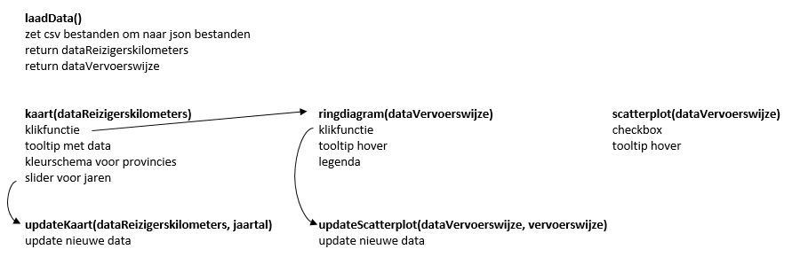

# Design document

Linsey Schaap (11036109)

## Data
De data is verkregen via het CBS via onderstaande linken:
* https://opendata.cbs.nl/statline/#/CBS/nl/dataset/83497ned/table?ts=1528104865883
* https://opendata.cbs.nl/statline/#/CBS/nl/dataset/83498ned/table?ts=1528113717793

Voor de visualisatie wordt gebruik gemaakt van alle provincies voor de jaren 2010 tot en met 2014 waarbij gekeken wordt naar de gegevens per persoon per jaar. Bij kenmerken van verplaatsing wordt alleen gekeken naar doordeweekse dagen en alle tijdstippen op 0 tot 7 uur na. Deze filters worden online aangebracht en vervolgens als een csv bestand gedownload. Hierna wordt de data nog een beetje opgeschoond om later makkelijk erdoorheen te lopen. Zo wordt (PV) achter Groningen en Utrecht verwijderd.

## Diagram

## Beschrijving elementen
### Kaart
Wanneer de gebruiker over de kaart beweegt zijn het aantal reizigerskilometers voor de desbetreffende provincie te zien. De gebruiker kan met behulp van de slider naar verschillende jaren kijken. Op de provincies kan worden geklikt waardoor zowel de scatterplot als de ringdiagram worden geüpdatet.

### Ringdiagram
In de ringdiagram wordt de verdeling van de gebruikte vervoerswijze in de provincie weergegeven. Om de exacte getallen te kunnen zien kan over de ringdiagram worden bewogen en komt er meer informatie door middel van een tooltip. Op een aantal vervoerswijze kan ook worden geklikt waarna de scatterplot wordt geüpdatet.

### Scatterplot
De scatterplot laat zien voor de aangeklikte provincie in de kaart zien hoe de verdeling is tussen het aantal kilometers dat wordt gereisd ten opzichte van het aantal minuten dat wordt gereisd. De gebruiker kan in de checkbox aangeven welke dagen en tijdstippen terug moeten komen in de scatterplot.

