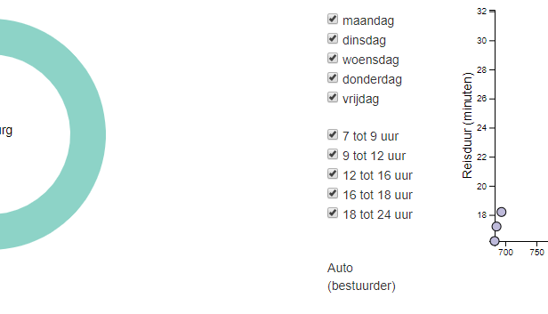
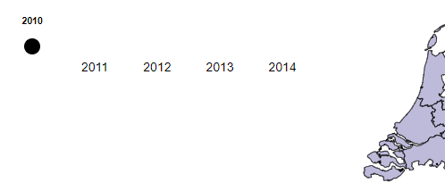
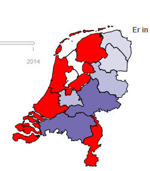

# Voortgang

Linsey Schaap (11036109)

## Week 1
### Woensdag
* Design document afgemaakt
* Begonnen aan ringdiagram
  * tooltip achter ringen
  * tekst van tooltip valt buiten het beeld (marge rechts vergroten zorgt voor kleinere ringdiagram)

  

* Tooltip kaart absoluut gemaakt maar nog niet op de juiste plek

### Donderdag
* Verder gegaan aan de ringdiagram
  * Update functie doet het nu als er op de kaart wordt geklikt
  * Tooltip staat nu voor de ringen
  * Er zijn 4 provincies; Utrecht, Zeeland, Groningen en Friesland die twee rode blokken hebben

 

* Begonnen aan de scatterplot, maar problemen met de tooltip die niet wilt verschijnen wanner je met je muis over een cirkel beweegt

## Week 2
### Maandag
* Verder aan de ringdiagram
  * De fout van de twee kleuren is er nu uit, door kleur toe te voegen aan de hand van vervoerswijze en niet aan de afstand, hierdoor kregen vervoerswijze met dezelfde afstand dezelfde kleur. En de diagram sorteert niet meer op afstand, hierdoor kan er beter worden vergeleken tussen de provincies.
  * Moeite met een transition. Krijg het niet voor elkaar om dat toe te passen

* Bootstrap toegevoegd
  * Begin gemaakt aan layout
  * Krijg de visualisaties niet binnen de verschillende secties. Met hulp erachter gekomen dat een element niet aan de body moet worden toegewezen, maar aan de juiste container

### Dinsdag
* Layout
  * De visualisaties staan nu allemaal op de juiste plek
* Verder gegaan aan de scatterplot
  * Update functie aangemaakt, waarbij de assen een trasition hebben, maar de cirkels nog niet.
  * Tooltip 2 klopt nog niet, omdat hij altijd aangeeft dat het om Nederland gaat
  * Een checkbox toegevoegd (werkt nog niet optimaal, omdat hij bij het klikken op een nieuwe provincies alle cirkels weer laat zien, ongeacht of er delen in de checkbox uit staan)

### Woensdag
* Scatterplot
  * De tooltip verdwijnt nu zodra er op een andere provincie wordt geklikt. Hierdoor staat er geen foutieve infomatie meer.
  * De checkbox doet het nu goed, ook wanneer er op een andere provincie wordt geklikt
  * Er wordt een foutmelding gegeven wanneer er geen enkel vinkje meer staat aangevinkt in de checkbox, maar hij gaat daarna alsnog weg (moet nog aangepast worden)
* Ringdiagram
  * Iedere ring heeft nu een onclick functie of geeft een foutmelding als er geen info over te vinden is.
  * Wanneer de klikfunctie wordt gebruikt wordt er aangegeven op welke functie is geklikt. De plek waar dit wordt geprint kan effectiever.

 

### Donderdag
* Slider
  * Onderzoek gedaan naar verschillende sliders en een aantal proberen te implementeren, maar nog zonder succes. Later verder aan werken met behulp van een nieuwe bron die ik heb gevonden.

## Week 3
### Maandag
* Slider gemaakt
  * Alles wordt geupdatet voor het juiste jaartal, dus de ringdiagram, de kaart en de scatterplot
  * Hij is nog wel een beetje buggy, want je kan niet klikken op een willekeurig jaartal
* Scatterplot
  * De assen een naam gegeven
  * De bolletjes worden nu groter wanneer je eroverheen gaat
  * Kleurverschil aangebracht tussen dagen en tijdstippen
  * Wanneer over de box van de checkbox wordt gehoverd wordt het bolletje ook groter, alleen nog niet wanneer er op een andere provincie wordt geklikt

### Dinsdag
* Kaart
  * Kleurenschema gemaakt, maar hij werkt niet vanaf het begin alleen wanneer er overeen is geweest met de muis. Later op de dag opgelost door de volgorde te veranderen van het oproepen van data.

* Scatterplot
  * De bolletjes hebben nu een transition waardoor ze mooi overgaan naar de volgende data als er een update is. Had er eerst problemen mee want alle bolletjes verdwenen de hele tijd wanneer ik gebruik maakte van exit(), maar dankzij assistentie kwamen we er na een tijdje uit dat ze niet verdwenen en kon ik later nog de transition implementeren.
  * De laatste checkbox kan niet uitgezet worden door de gebruiker
* Slider
  * Gevraagd om de bug uit de slider te halen, maar Tim kan het ook niet vinden.

### Woensdag
* Slider en legenda
  * De slider werkt nu ook wanneer je er op klikt en ik heb daardoor een hoop onnodige code kunnen verwijderen
  * Een legenda gemaakt voor de kaart
* Layout
  * De kleuren van de site aangepast

### Donderdag
* Layout
  * De plek waar de visualisaties staan veranderd aan de hand van bootstrap, door de kolom breedte aan te passen.
  * Een afbeelding gemaakt aan de hand van flaticons voor de site.
* Slider
  * De slider update naar Nederland, maar zou dat eigenlijk niet moeten doen, maar de laatst aangeklikte provincie laten zien.
* Reset knop gemaakt
  * De knop zet alles terug naar Nederland en 2010, maar zet niet alle vinkjes weer aan (morgen vragen of dat zou moeten)

## Week 4
### Maandag
* Reset
  * De knop zet nu alle vinkjes weer aan
  * Alle tooltips gaan nu ook uit bij het klikken op de knop
  * Wanneer er een provincie was aangeklikt gaat hij bij het gebruik van de slider weer over op de laatst aangeklikte provincie (fout) later vandaag heb ik provincie globaal gemaakt zodat dit probleem kon worden opgelost.
* Slider
  * De juiste provincie wordt meegegeven aan de slider waardoor de slider werkt voor de aangeklikte provincie.
* Checkbox
  * De laatste twee vinkjes kunnen niet uit nu ipv alleen de laatste.
  * Nadat de hover over een bolletje in de scatter is gebruikt wordt het bolletje niet meer vergroot wanneer er over een box in de checkbox wordt gehoverd. Dit kwam doordat ik de r op verschillende manier aanpaste. Een keer met attr en een keer met style. Nu is dit opgelost.

### Dinsdag
* md
  * Proposal.md aangemaakt
  * Frame van Report.md opgeschreven
* Site
  * De tekst bij home geschreven
* Ringdiagram
  * Bug eruit gehaald. Hij liet niet altijd de tooltip zien.

### Woensdag
* files
  * Bij alle functies heb ik de manier van filteren korter opgeschreven
  * Er voor gezorgt dat alle regels niet heel veel langer zijn dan 80 regels
  
