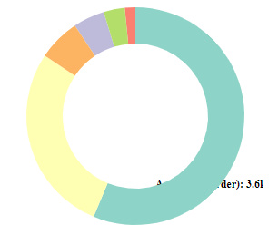
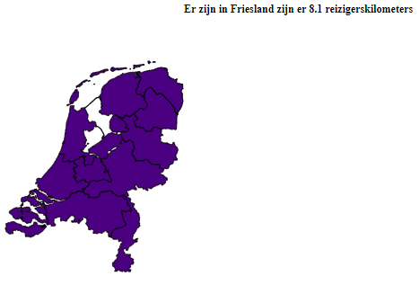
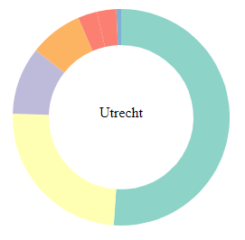

# Voortgang

Linsey Schaap (11036109)

## Week 1
### Woensdag
* Design document afgemaakt
* Begonnen aan ringdiagram
  * tooltip achter ringen
  * tekst van tooltip valt buiten het beeld (marge rechts vergroten zorgt voor kleinere ringdiagram)
  
  
  
* Tooltip kaart absoluut gemaakt maar nog niet op de juiste plek

### Donderdag
* Verder gegaan aan de ringdiagram
  * Update functie doet het nu als er op de kaart wordt geklikt
  * Tooltip staat nu voor de ringen
  * Er zijn 4 provincies; Utrecht, Zeeland, Groningen en Friesland die twee rode blokken hebben
 
 

* Begonnen aan de scatterplot, maar problemen met de tooltip die niet wilt verschijnen wanner je met je muis over een cirkel beweegt

## Week 2
### Maandag
* Verder aan de ringdiagram
  * De fout van de twee kleuren is er nu uit, door kleur toe te voegen aan de hand van vervoerswijze en niet aan de afstand, hierdoor kregen vervoerswijze met dezelfde afstand dezelfde kleur. En de diagram sorteert niet meer op afstand, hierdoor kan er beter worden vergeleken tussen de provincies.
  * Moeite met een transition. Krijg het niet voor elkaar om dat toe te passen

* Bootstrap toegevoegd
  * Begin gemaakt aan layout
  * Krijg de visualisaties niet binnen de verschillende secties. Met hulp erachter gekomen dat een element niet aan de body moet worden toegewezen, maar aan de juiste container
