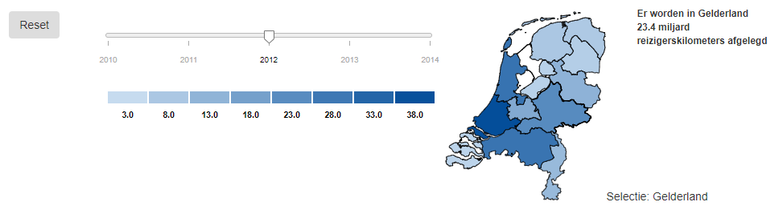
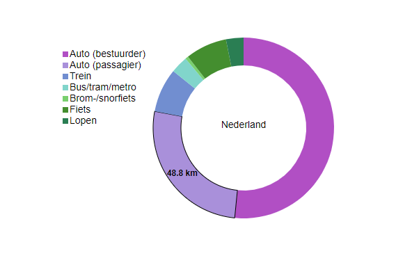
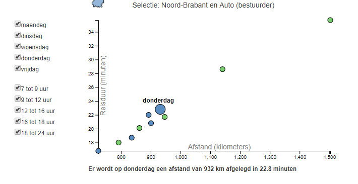

# Hoe verplaatst Nederland zich?
Linsey Schaap (11036109)

https://linseyuva.github.io/Programmeerproject/index.html

## De site
Met behulp van deze site krijgt de gebruiker een beter beeld van hoe Nederland zich verplaatst.
Hierbij wordt onderscheid gemaakt in de manier waarop men zich verplaatst en de dagen en de tijdstippen waarop wordt gereisd.

De site bevat een reset knop.
Deze knop zet alle data, en daarmee dus alle visualisaties, weer terug naar het jaar 2010 en Nederland.
De slider op de site zorgt ervoor dat de data die wordt gerepresenteerd overeenkomt met het gekozen jaartal.

In de kaart is voor alle provincies te zien hoeveel miljard kilometers men aflegt in een bepaald jaar.
De kleur laat zien hoeveel er wordt afgelegd. Dus hoe donkerder de kleur hoe meer er wordt gereisd.
Om de precieze hoeveelheid te achterhalen kan over de provincie worden gehoverd.

Door te klikken op een provincie in de kaart wordt de ringdiagram getekend voor deze provincie.
In de legenda is te zien welke vervoerswijze bij welke kleur hoort.
De ringdiagram heeft een hoverfunctie die ervoor zorgt dat het aantal kilometers wordt laten zien die bij de vervoerswijze hoort.

Wanneer er op een onderdeel van de ring wordt geklikt wordt de scatterplot geüpdatet.
Om erachter te komen welk tijdstip of welke dag hoort bij welk punt in de scatterplot kan er over de punten worden gehoverd.
Het punt wordt dan groter en er komt een tooltip die laat zien welke dag of welk tijdstip het is.
Een andere manier is om over de boxen in de checkbox te bewegen.
Het datapunt dat correspondeert wordt dan ook groter.
Voor meer informatie kan ook op de punten worden geklikt en er verschijnt dan onder de scatterplot een tooltip.

Boven de scatterplot wordt in een tooltip bijgehouden welke selecties zijn toegepast.
Wanneer er op een provincie in de kaart wordt geklikt wordt deze tooltip bijgewerkt en ook wanneer er op een vervoerswijze in de ringdiagram wordt geklikt.

## Copyright statement
Copyright 2018 Linsey Schaap \
Licensed under the Apache License, Version 2.0 (the "License")

## Bronnen
* https://bl.ocks.org/johnwalley/e1d256b81e51da68f7feb632a53c3518
BSD 3-Clause License.
* http://d3-legend.susielu.com/
Geen license.
* https://bl.ocks.org/mbostock/3887193
GNU General Public License, version 3.
* https://bl.ocks.org/johnnygizmo/531991a77047112b7ca89f78b840fba5
Geen license.
