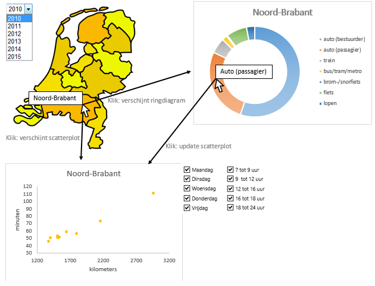

# Programmeerproject
Linsey Schaap (11036109)

## Probleemstelling
Dagelijkse verplaatst men zich, maar het werk, voor boodschappen of om een hobby of sport uit te kunnen oefenen. Maar in welke provincie leggen ze de meeste kilometers of en op welke manier doet men dit. Met deze visualisatie wordt dit in kaart gebracht. Aan de hand van de visualisaties kunnen conclusies worden getrokken die voor de desbetreffende persoon relevant kunnen zijn. Zoals het kiezen van snelste vervoerswijze op dat moment of in de juiste provincie een fietswinkel beginnen.

## Oplossing
Om erachter te komen hoe de Nederlander zich verplaatst, wordt in kaart gebracht hoeveel reizigerskilometers er per provincie worden afgelegd, welke vervoerswijze wordt gebruikt en op welk tijdstip van de week en dag dit plaats vindt.

Op de kaart is voor verscheidene jaren te zien hoeveel reizigerskilometers er per provincie worden afgelegd. De provincies zijn aanklikbaar waarna in een ringdiagram te zien is op welke wijze men zich vervoerd en tegelijkertijd wordt in een scatterplot zichtbaar hoe de verhouding is tussen de hoeveelheid minuten en het aantal kilometers. Als er op een vervoerswijze in de ringdiagram wordt geklikt zal de scatterplot worden geüpdatet voor de desbetreffende vervoerswijze.

### Functies
* Er kan uit verscheidene jaartallen gekozen worden waarna de kaart zal worden geüpdatet.

## Vereisten
