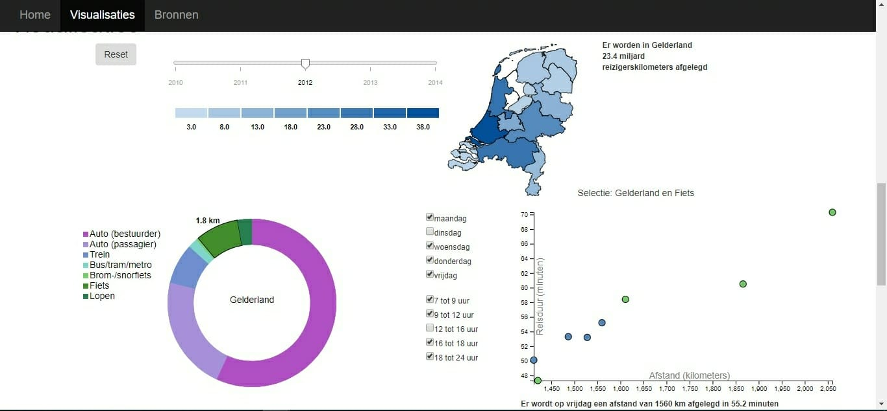

# Report

In bovenstaaande screenshot zijn alle visualisaties te zien.
De visualisaties bestaan uit een kaart, ringdiagram en scatterplot.
Verder zijn er nog twee interactieve onderdelen, de slider en een checkbox.
De slider haalt de data op voor het gekozen jaar (2010 t/m 2014).
De checkbox is onderdeel van de scatterplot.
Door boxen uit te zetten verdwijnen de desbetreffende datapunten in de scatterplot.

De kaart heeft een hover functie waarbij het aantal kilometers zichtbaar wordt voor de desbetreffende provincie.
Door te klikken op de kaart worden de ringdiagram en scatterplot geupdatet.
De ringdiagram heeft ook zowel een hover functie als klikfunctie.
Na het klikken op een onderdeel van de ring zal de scatterplot opnieuw worden geupdatet.
Voordat de scatterplot kan worden geupdatet wordt eerst de functie checkbox aangeroepen.
Deze functie bekijkt welke vinkjes aan staan en geeft deze data door aan de update functie voor de scatterplot.

Problemen tijdens het programmeren en de grooste verschillen met design.md

Waarom zijn deze veranderingen doorgevoerd? Welke afwegingen moest ik maken? Wat zou er beter kunnen als ik meer tijd had.
