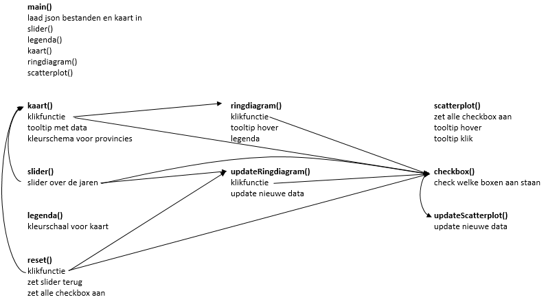

# Report

De visualisaties bestaan uit een kaart waar

Uitleg functionaliteit:
Mijn site bestaat uit een kaart, een ringdiagram en een scatterplot.
Daarna in detail

Problemen tijdens het programmeren en de grooste verschillen met design.md

Waarom zijn deze veranderingen doorgevoerd? Welke afwegingen moest ik maken? Wat zou er beter kunnen als ik meer tijd had.
